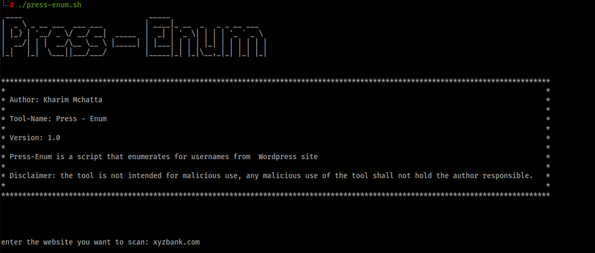

# press-enum

------------------ Requirements ------------------------------------
1. download figlet 
2. apt-get install figlet

------------------ what the tool does -------------------------------

This is a tool that is used to scans for usernames on wordpress sites. 
it looks for usernames in various places like
    
    1. Rest API
     
    2. Rest route
     
    3. Author Archive
    
    4. Feeds
     
    5. sitemap XML

------------------- other information -------------------------------

Note: the tool shall be continually imporved as days goes on and more features shall be added in the upcoming days 

Disclaimer: any malicious use of the tool doesnt hold the author responsible, this tool should be used solely for educational and ethical purpose. 

